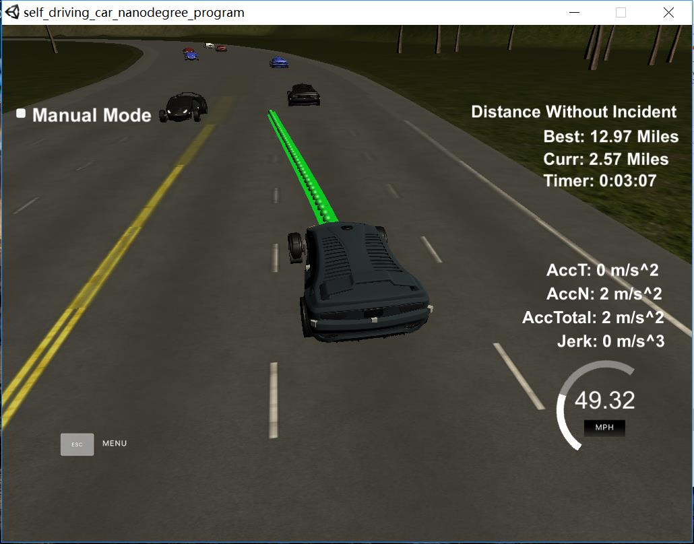
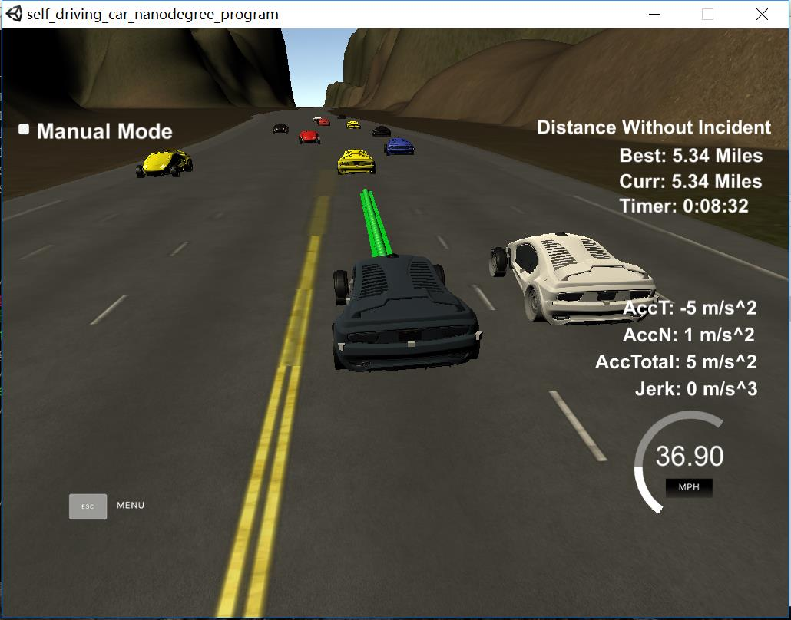

# CarND-Path-Planning-Project
Udacity Self-Driving Car Nanodegree - Path Planning Project




# [Rubic](https://review.udacity.com/#!/rubrics/1020/view) points

## Compilation

### The code compiles correctly.

The code compile without any errors with cmake and make.

```
# cmake ..
-- The C compiler identification is GNU 5.4.0
-- The CXX compiler identification is GNU 5.4.0
-- Check for working C compiler: /usr/bin/cc
-- Check for working C compiler: /usr/bin/cc -- works
-- Detecting C compiler ABI info
-- Detecting C compiler ABI info - done
-- Detecting C compile features
-- Detecting C compile features - done
-- Check for working CXX compiler: /usr/bin/c++
-- Check for working CXX compiler: /usr/bin/c++ -- works
-- Detecting CXX compiler ABI info
-- Detecting CXX compiler ABI info - done
-- Detecting CXX compile features
-- Detecting CXX compile features - done
-- Configuring done
-- Generating done
-- Build files have been written to: CarND-Path-Planning-Project/build


# make
Scanning dependencies of target path_planning
[ 50%] Building CXX object CMakeFiles/path_planning.dir/src/main.cpp.o
[100%] Linking CXX executable path_planning
[100%] Built target path_planning
```

## Valid trajectories

### The car is able to drive at least 4.32 miles without incident.
I ran the simulator for more than 5 miles without incidents:




### The car drives according to the speed limit.
No speed limit red message was seen.

### Max Acceleration and Jerk are not Exceeded.
Max jerk red message was not seen.

### Car does not have collisions.
No collisions.

### The car stays in its lane, except for the time between changing lanes.
The car stays in its lane most of the time but when it changes lane because of traffic or to return to the center lane.

### The car is able to change lanes
The car change lanes when the there is a slow car in front of it, and it is safe to change lanes (no other cars around) or when it is safe to return the center lane.

## Reflection

Based on the provided code from the seed project, the path planning algorithms start at [src/main.cpp](./src/main.cpp#L108) line 108 to the line 271.

The code consist of three parts: Prediction, Behavior and Trajectory.

### Prediction [line 108 to line 145](./src/main.cpp#L108)
This part of the code deal with the telemetry and sensor fusion data. It intents to reason about the environment. In the case, we want to know three aspects of it:

- Is there a car in front of us blocking the traffic.
- Is there a car to the right of us making a lane change not safe.
- Is there a car to the left of us making a lane change not safe.

These questions are answered by calculating the lane each other car is and the position it will be at the end of the last plan trajectory. A car is considered "dangerous" when its distance to our car is less than 30 meters in front or behind us.

### Behavior [line 146 to line 169](./src/main.cpp#146)
This part decides what to do:
  - If we have a car in front of us, do we change lanes?
  - Do we speed up or slow down?

### Trajectory [line 171 to line 271](./src/main.cpp#171)
This code does the calculation of the trajectory based on the speed and lane output from the behavior, car coordinates and past path points.

First, the last two points of the previous trajectory (or the car position if there are no previous trajectory) are used in conjunction three points at a far distance to initialize the spline calculation.

To make the work less complicated to the spline calculation based on those points, the coordinates are transformed (shift and rotation) to local car coordinates.

In order to ensure more continuity on the trajectory (in addition to adding the last two point of the pass trajectory to the spline adjustment), the pass trajectory points are copied to the new trajectory.

The rest of the points are calculated by evaluating the spline and transforming the output coordinates to not local coordinates. Worth noticing the speed change is decided on the behavior part of the code.
